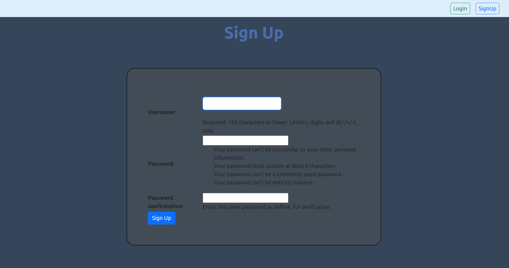
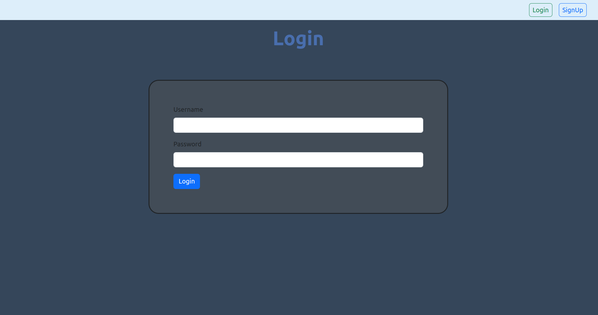
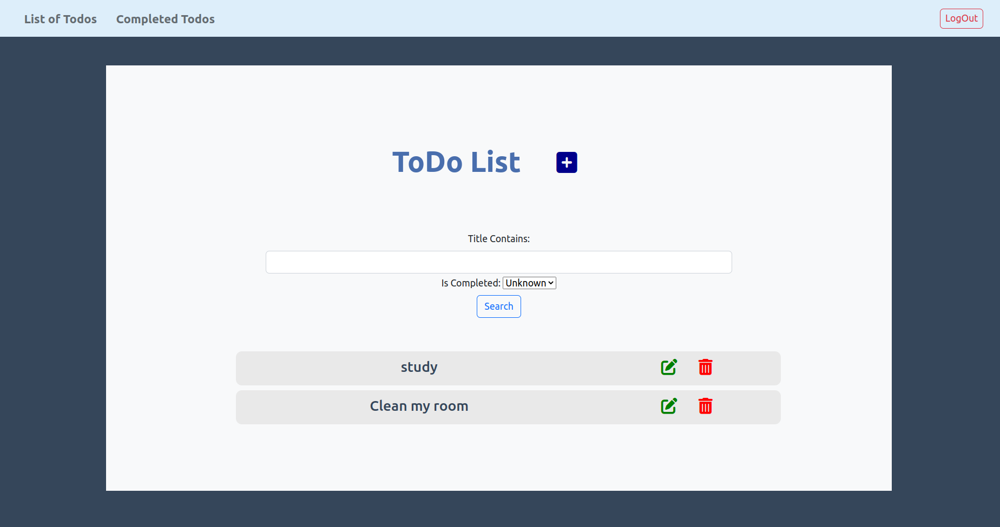
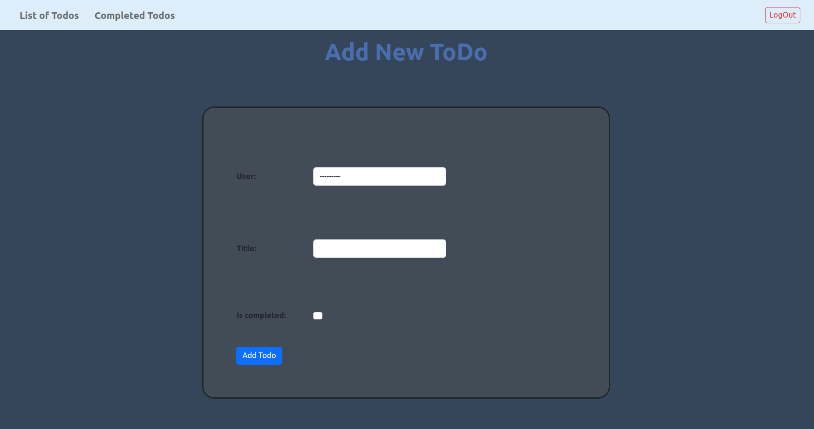
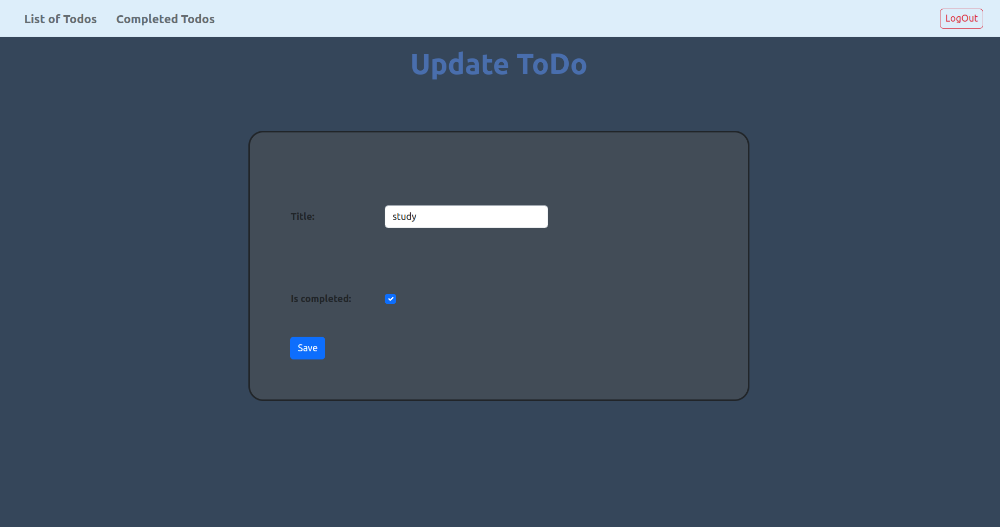

# ToDo List Using Django Framework

## Introduction

This is a simple ToDo list application using Django framework. After user login or register he/she is allowed you to add, edit, delete and view their own tasks.

## API Endpoints
    
- `GET /` - Get all todos
- `GET /detailed/:id` - Get detailed todo
- `POST /createTodo/` - Create a todo
- `POST /updateTodo/:id` - Update a todo
- `DELETE /deleteTodo/:id` - Delete a todo
- `POST /signup` - Create a user
- `POST /login` - Login a user
- `GET /logout` - Logout a user
- `GET /completedTodos` - Get all completed todos


## Requirements

- Python 3.6
- Django 2.0.2

## Installation

- Clone the repository
```bash
git clone 
```

- Create a virtual environment and activate it
```bash
python3 -m venv env
source env/bin/activate
```
```
- Install the requirements
```bash
pip install -r requirements.txt
```

## Usage

- Run the server
```bash
python manage.py runserver
```
- Open the browser and go to http://localhost:8000


## Screenshots

- Sign up page


- Login page


- Home page with search and filter options


- Add todo page


- Edit todo page

